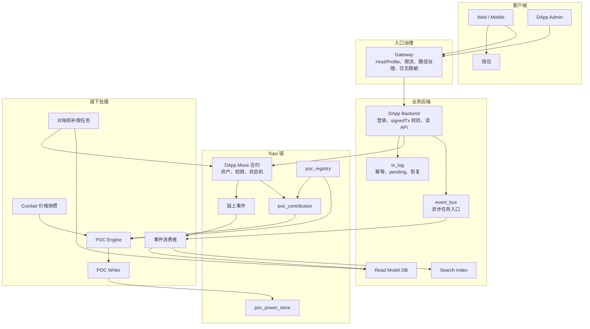

# 1. 总览、原则与工程架构

先建立文档定位、核心工程原则和推荐系统架构，帮助团队统一链上事实、链下服务和 POC 边界。

## 本章包含

- 0. 文档定位
- 1. 核心工程原则
- 2. 推荐工程架构

## 0. 文档定位

本文面向 DApp 合约、后端、前端、事件消费者、搜索、运维和测试开发者，说明在 Topo 链上建设生产级 DApp 的推荐工程形态。

本文与 `Topo链DApp生态合作与POC接入白皮书.md` 分工如下：

| 文档 | 目标读者 | 内容边界 |
|---|---|---|
| `Topo链DApp生态合作与POC接入白皮书.md` | 生态合作方、投资人、业务方 | 业务价值、可信闭环、合作接入和治理边界 |
| 本文 | 开发者、架构师、测试和运维 | 合约设计、signed transaction、事件同步、POC 接入、测试和上线检查 |

本文默认 DApp 将直接在 Topo 链上重新设计合约。Web3 商城只作为交易型 DApp 参考案例，不保留外置适配层。

## 1. 核心工程原则

1. 链上合约维护资产、权限、关键状态机和可信事件。
2. 后端负责入口安全、交易语义校验、幂等和读 API，不替代链上事实。
3. 前端负责交易体验和状态展示，不保存私钥、生产 API key 或管理员密钥。
4. 事件消费者只投影链上事实，不制造链上事实。
5. 读模型可以异步落后，但必须可重放、可修复、可对账。
6. POC power 只能来自 PowerStore committed power，本地积分、预估贡献和普通事件都不能当作 power。
7. Web3 商城类 DApp 的业务结算和 POC 贡献发放必须解耦，POC 异常不能阻塞商家资金结算。

## 2. 推荐工程架构

职责边界：

| 层 | 必须承担 | 不应承担 |
|---|---|---|
| Frontend | 钱包连接、交易构造、状态展示、错误恢复 | 私钥保存、绕过后端语义校验 |
| Gateway | Host/Profile 分流、限流、路径封禁、日志脱敏 | 业务状态判断 |
| Backend | 登录、签名交易校验、tx hash 幂等、读 API、异步任务入口 | 覆盖链上资产和状态事实 |
| Move 合约 | 资产、权限、核心状态机、事件、view | 大列表搜索、运营报表、复杂聚合 |
| Consumer | 链上事件解析、读模型同步、重试、对账 | 伪造链上事实 |
| POC Engine | 周期结算、价格快照、贡献聚合、账本 | 实时逐笔修改用户 power |
| POC Writer | 写回下一周期 staged power、链上对账 | 修改当前周期 committed power |
