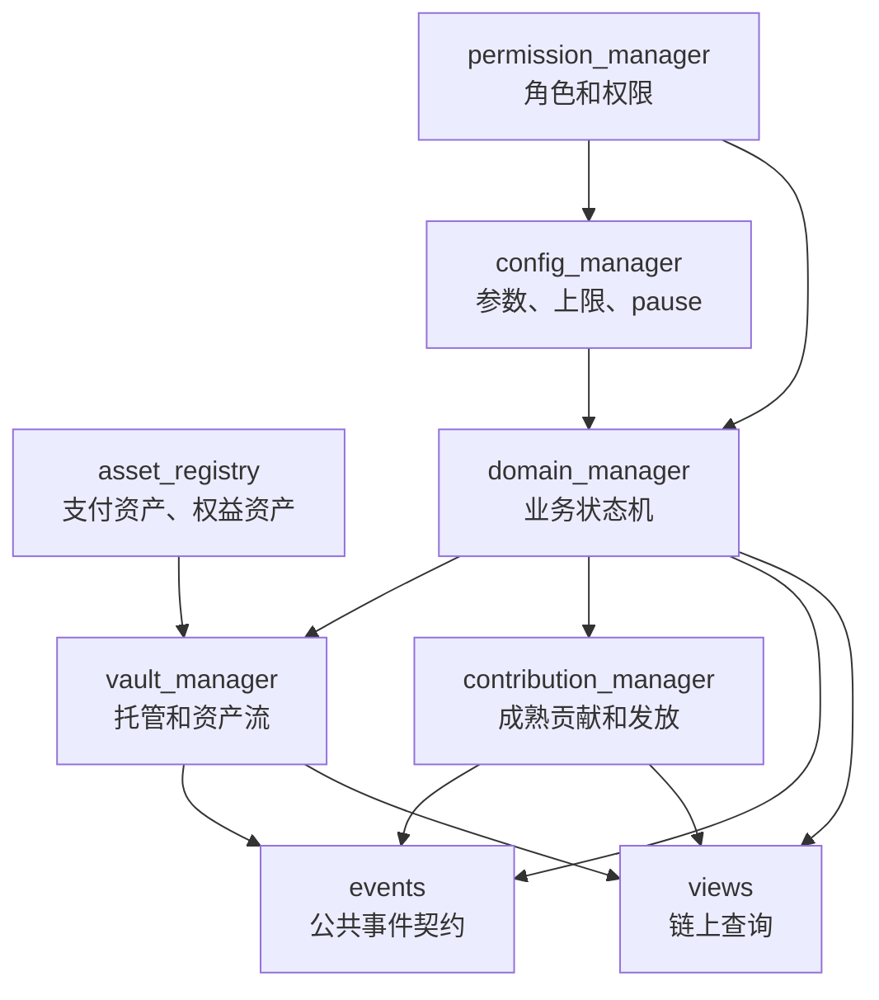
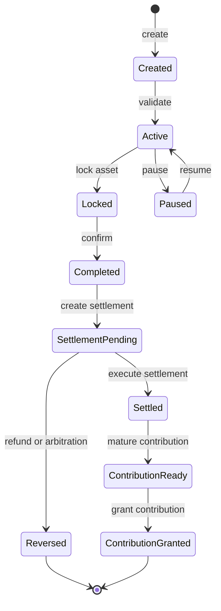

# 2. 链上合约、状态机与事件契约
{: .no_toc }

聚焦 Move 合约模块拆分、状态机、事件契约和 view 设计，这是 DApp 可信事实的核心。
{: .fs-6 .fw-300 }

## 目录
{: .no_toc .text-delta }

1. TOC
{:toc}

---

## 本章包含
{: .no_toc }

- 3. 链上合约设计

## 3. 链上合约设计

### 3.1 推荐模块拆分

模块职责：

| 模块 | 职责 | 关键约束 |
|---|---|---|
| `permission_manager` | 管理角色、管理员、多签或治理权限 | 不写业务状态 |
| `config_manager` | 费率、上限、白名单、pause、延迟生效 | 参数变更必须可审计 |
| `asset_registry` | 支付资产和权益资产白名单、精度、metadata | 禁止临时传入未登记资产 |
| `domain_manager` | 业务对象资源和状态机 | 每个 entry function 推动明确状态转移 |
| `vault_manager` | 托管、支付、退款、提现、结算 | 资产流必须和状态流一致 |
| `contribution_manager` | 成熟贡献识别、发放、重复发放保护 | 只发放贡献，不计算 POC power |
| `events` | 事件结构、版本字段、公共契约 | 字段变更必须同步后端、消费者和测试 |
| `views` | 前端、后端和对账所需链上查询 | 不做复杂链下聚合 |

### 3.2 状态机先行

设计规则：

1. 所有状态必须定义允许的下一状态。
2. 所有 entry function 必须校验 signer、权限、状态、金额和资产。
3. 资产转移、状态更新和事件输出应在同一交易内保持原子性。
4. 批处理入口必须设置数量上限，避免无界循环。
5. 贡献发放必须基于成熟事实，不基于支付成功或前端展示状态。
6. 退款、仲裁、暂停、恢复和治理修正必须在状态机中预留路径。

### 3.3 事件设计

事件不是日志，而是跨前端、后端、消费者、搜索、审计和 POC 的公共契约。

事件字段建议：

| 字段 | 说明 |
|---|---|
| `event_version` | 事件结构版本 |
| `app_id` / `domain` | 应用或业务域 |
| `object_id` | 业务对象 ID |
| `actor` | 发起人或 signer |
| `beneficiary` | 资产或贡献受益人 |
| `asset_type` | 支付或权益资产 |
| `amount` | 金额或数量，使用统一精度 |
| `old_state` / `new_state` | 状态变化 |
| `reason_code` | 业务原因码 |
| `tx_context` | 可关联 tx hash、event version 或链上版本 |
| `poc_ref` | 需要接入 POC 时关联贡献来源事实 |

事件兼容规则：

1. 新增字段优先使用新版本事件，不破坏旧消费者。
2. 删除或改名字段必须同步 ABI 清单、消费者解析、测试和文档。
3. 消费者不能只依赖本地 payload，应能回链上查询完整事实。

### 3.4 View 设计

View 用于读取链上事实，不用于做复杂报表。

推荐 view：

| View | 用途 |
|---|---|
| 业务对象状态 | 前端和后端确认当前状态 |
| 资产托管余额 | 对账资产流 |
| 配置和 pause 状态 | 前端提示和后台治理 |
| 成熟贡献状态 | 判断是否可发放 POC 贡献 |
| POC 发放状态 | 判断是否已经产生 ContributionEvent |
