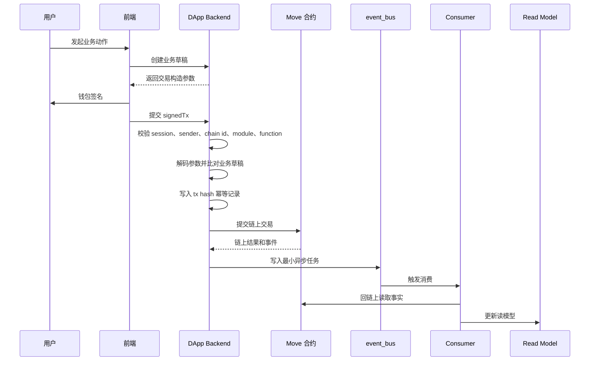
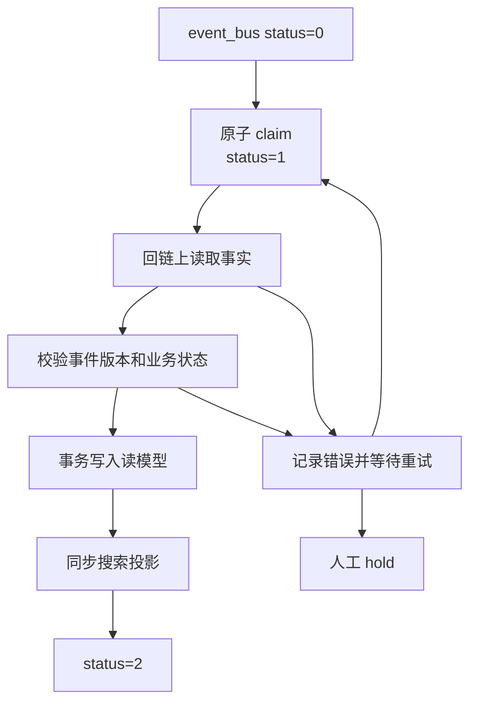

# 3. 交易入口、事件同步与读模型
{: .no_toc }

把 signed transaction 入口校验、API 到 ABI 清单、event_bus 消费和读模型投影放在同一章，形成完整链下处理闭环。
{: .fs-6 .fw-300 }

## 目录
{: .no_toc .text-delta }

1. TOC
{:toc}

## 4. Signed Transaction 入口设计

后端不能只转发 signed transaction。它必须在提交链上前完成身份、交易目标、参数语义和幂等校验。

### 4.1 端到端流程



### 4.2 必须校验的内容

| 类别 | 校验项 |
|---|---|
| 身份 | 当前 session、钱包地址、wallet binding、后台角色 |
| 链参数 | chain id、合约地址、module、function、过期时间 |
| 交易结构 | 参数数量、泛型参数、目标 entry function |
| 参数语义 | 业务对象归属、金额、资产、数量、商户、受益人、状态 |
| 幂等 | tx hash、业务 ID、pending/processed 状态 |
| 风控 | 频率、额度、pause、黑白名单、重复提交 |

不要只验证“能反序列化”。合法交易仍可能携带错误订单、错误资产、错误商户或错误金额。

### 4.3 API 到 ABI 清单

每个会提交链上交易的 API 都必须维护 API 到 ABI 清单。

| 字段 | 示例说明 |
|---|---|
| API 名称 | 业务动作名称，不要求对外暴露路径 |
| Move function | 目标 module 和 entry function |
| sender 要求 | 用户、商户、管理员、任务账号或多签 |
| 参数顺序 | 每个参数的类型、顺序、精度 |
| 泛型参数 | 资产类型、权益类型 |
| 后端语义校验 | 需要和读模型或业务草稿比对的字段 |
| 合约校验 | 合约内必须重新验证的规则 |
| 成功事件 | 链上事件名和版本 |
| 本地异步任务 | 只写最小 payload，例如 tx hash 和业务 ID |
| 幂等键 | tx hash 和业务 ID 的组合规则 |
| 测试 | 成功、重复提交、参数篡改、链上失败、本地失败 |

## 5. 事件同步和读模型

### 5.1 event_bus 语义

如果使用 `event_bus` 驱动异步消费者，`handle_status` 语义必须保持：

| 状态 | 含义 |
|---|---|
| `0` | unhandled，待处理 |
| `1` | handling，处理中 |
| `2` | handled，已处理 |

处理规则：

1. claim 必须原子化，避免多个消费者同时处理同一事件。
2. `handle_status=1` 必须有 lease 或超时回收。
3. 消费者必须支持重复事件、重复 tx hash 和已处理业务对象。
4. 失败要区分可重试、永久错误和需要人工 hold。
5. 消费者保留 last_error、retry_count、updated_at 和审计上下文。

### 5.2 消费者处理流程



### 5.3 读模型原则

1. 读模型字段必须标注来源：链上事实、本地投影、预估值或运营配置。
2. 链上事件是最终事实，本地 DB 不能覆盖链上状态。
3. 搜索投影必须从完整读模型生成，不能直接把 event payload 当文档真相。
4. 所有读模型更新要可重放、可修复、可追踪。
5. 对账链路必须能从用户地址追到业务对象、tx hash、链上事件、读模型、ContributionEvent 和 PowerStore。

推荐对账链：

```text
wallet address
  -> local member
  -> business object id
  -> tx hash
  -> chain event
  -> read model state
  -> mature contribution
  -> ContributionEvent
  -> POC period
  -> staged power
  -> committed power
```
