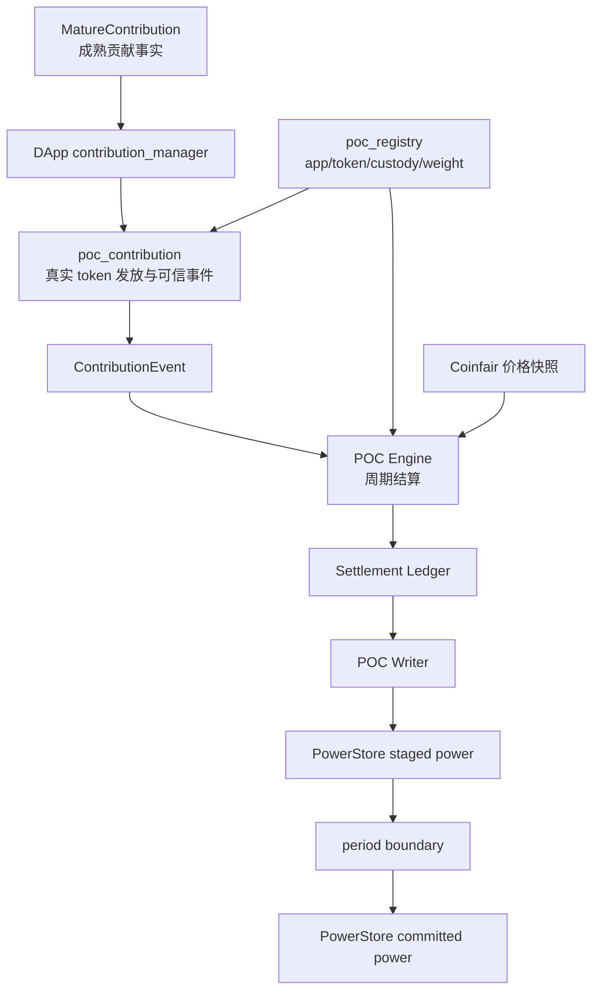
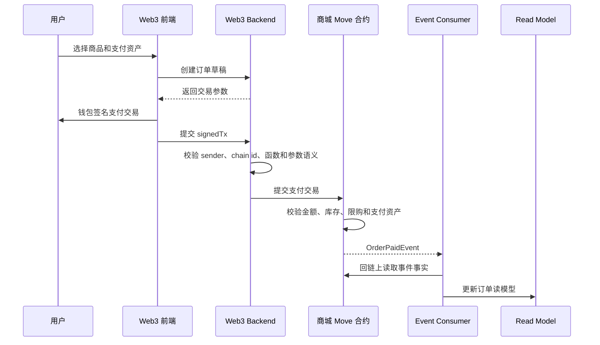
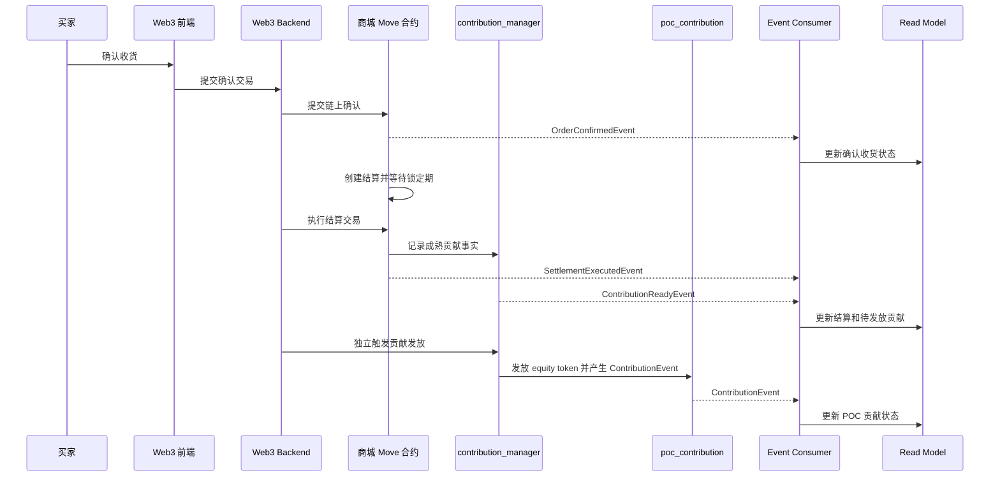

# 4. POC 接入与 Web3 商城案例
{: .no_toc }

先说明 DApp 侧 POC 贡献链路，再用 Web3 商城案例落到支付、履约、结算和贡献发放。
{: .fs-6 .fw-300 }

## 目录
{: .no_toc .text-delta }

1. TOC
{:toc}

## 6. POC 接入最佳实践

### 6.1 DApp 侧贡献模块

DApp 应在自身合约包内设计原生 `contribution_manager`，而不是外置适配层。

`contribution_manager` 只负责：

1. 识别成熟贡献事实。
2. 记录待发放和已发放状态。
3. 防止重复发放。
4. 校验 pause 和权限。
5. 调用 `poc_contribution` 可信路径发放 equity token。
6. 发出 DApp 自身贡献状态事件。

`contribution_manager` 不负责：

1. 计算 POC power。
2. 写 PowerStore。
3. 绕过 `poc_contribution` 自行发 ContributionEvent。
4. 把支付成功直接变成 POC power。

### 6.2 POC 可信贡献链路

关键规则：

1. DApp 必须先在 `poc_registry` 注册 app address、equity token、custody 和权重。
2. equity token 和 custody 必须与 Registry 记录匹配。
3. ContributionEvent 必须由 `poc_contribution` 发出。
4. Engine 使用 ContributionEvent、Registry 权重、Coinfair 价格快照和历史 power 结算。
5. Writer 只能写下一周期 staged power。
6. 周期边界后 staged power 才变成 committed power。

### 6.3 状态展示

前端必须区分以下状态：

| 状态 | 含义 |
|---|---|
| 业务已完成 | DApp 业务状态成熟，但未必可贡献 |
| 贡献已成熟 | 可以发放 equity token |
| 贡献已发放 | 已产生可信 ContributionEvent |
| 周期结算中 | Engine 正在结算或等待写回 |
| staged power | 已写入下一周期，尚未生效 |
| committed power | 当前周期已生效，可被下游读取 |

## 7. Web3 商城参考案例

Web3 商城是交易型 DApp 的参考案例。核心原则是：支付不是贡献，履约完成和结算成熟后才形成贡献；商家资金结算和 POC 贡献发放必须解耦。

### 7.1 支付流程

支付阶段要求：

1. 钱包签名必须由买家发起。
2. 后端必须校验交易目标函数和订单参数。
3. 合约必须重新校验金额、库存、限购和支付资产。
4. 支付成功只是候选贡献，不进入 POC power。

### 7.2 确认收货、结算和贡献发放

结算阶段要求：

1. 结算交易只形成成熟贡献事实，不依赖 POC 发放成功。
2. POC 发放入口必须校验成熟贡献、幂等、pause 和 custody 余额。
3. POC 异常不能阻塞商家资金结算。
4. 退款或仲裁发生在结算前时，必须回退或重算待成熟贡献。
5. 贡献已发放后发生争议，需要通过未来贡献抵扣、治理修正或专门 reversal 机制处理。
