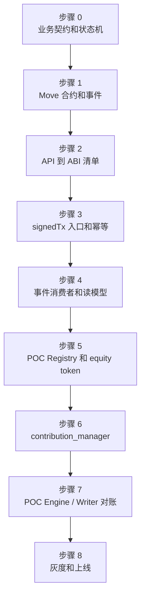

# 6. 上线清单、反模式与开发顺序

面向发布和交付阶段，汇总上线检查、常见反模式、开发顺序和最终边界总结。

## 本章包含

- 11. 上线检查清单
- 12. 常见反模式
- 13. 开发顺序建议
- 14. 总结

## 11. 上线检查清单

### 11.1 配置

- [ ] chain id 与目标 Topo 网络一致。
- [ ] RPC 和 Indexer endpoint 配置化。
- [ ] 合约地址配置化。
- [ ] 支付资产 metadata 和 symbol 配置一致。
- [ ] DApp equity token 的 Coinfair 市场已建立。
- [ ] POC Registry 中 App 已注册、白名单、custody 和权重已确认。
- [ ] custody 地址和 DApp 贡献模块使用地址一致。
- [ ] Gateway Host/Profile 已区分公网、Web3、管理和 internal 入口。
- [ ] 生产环境没有前端 API key、私钥和管理员密钥。

### 11.2 安全

- [ ] 会员和后台钱包登录都有 nonce 一次性消费。
- [ ] 所有 signedTx API 有 ABI 清单。
- [ ] 日志脱敏 Authorization、signedTx、API key、nonce。
- [ ] 内部路径不能公网访问。
- [ ] 链上管理入口只开放给管理 Profile。
- [ ] 关键合约参数更新需要多签或治理延迟。
- [ ] pause 和恢复流程已演练。

### 11.3 数据和运维

- [ ] `event_bus.handle_status` 语义未改变。
- [ ] 消费者有 lease 回收。
- [ ] tx pending 扫描已启用。
- [ ] 链上事件到读模型可对账。
- [ ] 搜索增量同步和兜底同步都已验证。
- [ ] POC ContributionEvent 到周期账本和 PowerStore 可对账。
- [ ] 异常周期、价格快照失败和 Writer 失败有 hold 流程。

## 12. 常见反模式

| 反模式 | 风险 | 正确做法 |
|---|---|---|
| 前端直连多个内部服务 | CORS、密钥、路径和限流失控 | 统一走 Gateway |
| 后端只转发 signedTx | 错误交易可进入链上 | 后端做入口校验和参数语义校验 |
| 只验证交易可解析 | 合法交易仍可能篡改业务参数 | 校验 module、function、sender、参数语义 |
| 本地 DB 状态当链上真相 | 本地状态可能落后或被修复 | 链上事件和 view 是最终事实 |
| event payload 直接写搜索文档 | 字段不完整或过期 | 回源查询完整读模型 |
| 支付成功立即给 POC power | 退款和未履约订单会膨胀贡献 | 结算成熟后发 POC 贡献 |
| 把本地积分当 POC power | 破坏 POC 可信边界 | equity token 可信发放后进入 POC |
| POC 发放阻塞业务结算 | POC 异常影响资金结算 | 结算状态和 POC 发放状态解耦 |
| 前台和管理后台入口混用 | 高风险链上入口误开放 | Profile、权限和后台入口分离 |

## 13. 开发顺序建议

| 步骤 | 产物 | 验收 |
|---|---|---|
| 步骤 0 | 状态机、事件清单、资产和贡献口径 | 业务、合约、后端和测试口径一致 |
| 步骤 1 | Move 合约、事件、view、初始化脚本 | Move 测试覆盖关键路径 |
| 步骤 2 | API 到 ABI 清单 | 每个 signedTx 入口有 sender、function、参数语义说明 |
| 步骤 3 | 后端入口、tx log、pending 恢复 | 重复提交和失败恢复可验证 |
| 步骤 4 | Consumer、读模型、搜索投影 | 链上事件可重放、读模型可对账 |
| 步骤 5 | Registry、equity token、custody、价格来源 | App POC 资格和价格输入可查 |
| 步骤 6 | contribution_manager | 成熟贡献、重复发放、pause、余额不足均可测试 |
| 步骤 7 | Engine/Writer 对账 | staged 和 committed power 可追踪 |
| 步骤 8 | 灰度、监控、回滚和 hold 流程 | 异常处理流程演练通过 |

## 14. 总结

开发者实现 Topo DApp 时，最重要的是守住三条边界：

1. 链上事实边界：资产、权限、关键状态机和事件必须由合约保护。
2. 链下体验边界：后端、消费者和读模型服务体验，但不能覆盖链上事实。
3. POC 可信边界：只有 `poc_contribution` 产生的 ContributionEvent 能进入周期结算，PowerStore committed power 才是最终可用权重。

Web3 商城参考案例的核心实现原则是：支付不是贡献，结算成熟后才形成贡献，贡献发放和商家资金结算解耦，POC Engine/Writer 周期性把可信贡献转化为 PowerStore 中的 committed power。
